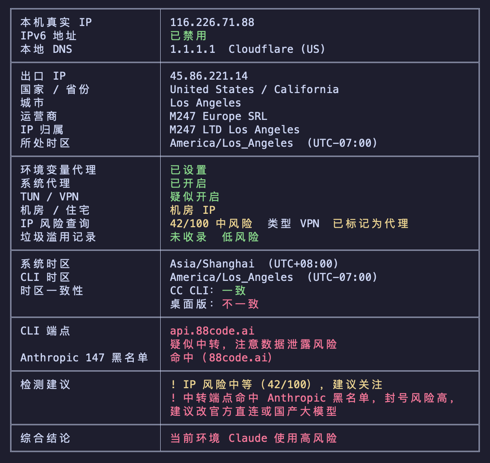

# ipcheck

A lightweight diagnostic tool for AI developers to verify network environment compatibility and IP reputation.

[中文](./README.md)



## Why

To ensure AI tools like Claude Code, OpenAI API, and Cursor run smoothly and reliably, a properly configured network environment is essential. Common issues that may affect performance:

- **IPv6 leaking real location** — Most proxies only handle IPv4; IPv6 can expose your actual geographic location
- **DNS leakage** — Local DNS servers can reveal your true location to AI services
- **High-risk IP** — Datacenter IPs or abused IPs may affect connection quality
- **Timezone mismatch** — Inconsistency between local timezone and IP geolocation
- **Endpoint routed through a relay** — Third-party relay endpoints may leak your data and even trigger account bans

`ipcheck` detects all these issues in one run, ensuring your AI tools run smoothly and stably.

## Features

| Check Item | Description |
|------------|-------------|
| Real Public IP / IPv6 | Reveals your real public IP via a domestic direct-connect echo (exposes your true ISP exit even with VPN/TUN on), and verifies whether IPv6 is disabled |
| Local DNS | Identify DNS origin (domestic/foreign), label known DNS providers |
| Exit IP Info | Exit (post-proxy) IP, country/region, city, ISP, IP ownership, timezone |
| Proxy Detection | On/off status of env proxy, system proxy, and TUN/VPN |
| IP Type & Risk | Datacenter/residential detection, proxycheck.io risk score, StopForumSpam abuse records, whether flagged as proxy |
| Timezone Consistency | System timezone and CLI timezone (all IANA), compared against the exit IP timezone for both CC CLI (honors `$TZ`) and the desktop app (uses system timezone) |
| Claude Endpoint Check | Detects whether the Claude Code endpoint is official-direct / a domestic LLM / a third-party relay; relays are flagged for data-leak and ban risk and matched against a known-endpoint blacklist |
| Overall Verdict | Aggregates all checks into a one-line assessment: high / medium / low risk for running Claude |

## Install

```bash
pip install ai-ipcheck
```

## Usage

```bash
ipcheck
```

### Requirements

- Python 3.10+
- macOS / Linux / Windows

## Understanding the Results

**Real Public IP & DNS** — The real public IP is obtained via a domestic direct-connect echo, exposing your true ISP exit even with VPN/TUN on, so you can tell whether your real identity leaks. Disable IPv6 if possible — most proxies don't handle IPv6 traffic, which may expose two IPs from different regions at once. If a domestic DNS is detected, adjust DNS settings in your proxy software.

**Exit IP Info** — Shows your exit IP after proxy, including country/region, ISP, IP ownership, and timezone. These directly affect how AI services evaluate your request origin.

**Proxy Detection** — `ipcheck` reports the on/off status of environment proxy variables, system proxy, and TUN/VPN. System proxy status only describes OS configuration; it does not guarantee every CLI process inherits that proxy. Tools with sandboxing or separate network behavior, such as Codex or Claude Code, may need explicit `HTTP_PROXY` / `HTTPS_PROXY` settings, or TUN mode as a fallback.

**IP Risk Assessment** — Identifies whether your IP is residential or datacenter. Datacenter IPs aren't necessarily problematic, but the tool will query risk scores and abuse records. Switch nodes if your risk score is high.

**Timezone Consistency** — Two comparisons: **CC CLI** compares the CLI timezone (honors `$TZ`) against the exit IP timezone, while **desktop app** compares the system timezone (ignores `$TZ`) against it. Claude Code CLI honors `$TZ`, so set `TZ` in your shell or in the `env` block of `~/.claude/settings.json` to an IANA timezone matching your exit IP (e.g., `America/Los_Angeles`); the Claude desktop app uses the system timezone, which must be changed in system settings.

**Claude Endpoint Check** — Reads Claude Code's `ANTHROPIC_BASE_URL` to determine whether it is official-direct, a domestic LLM (does not go through Anthropic, no ban risk), or a third-party relay (flagged as "suspected relay, watch for data leakage"), and matches it against a known-endpoint blacklist — a hit raises the overall risk.

**Overall Verdict** — At the end of the report, in its own block, `ipcheck` aggregates all checks into a single bottom line: whether your current environment is low / medium / high risk for running Claude. Check this line before launching Claude.

## License

[MIT](LICENSE) © 2026 stormzhang
